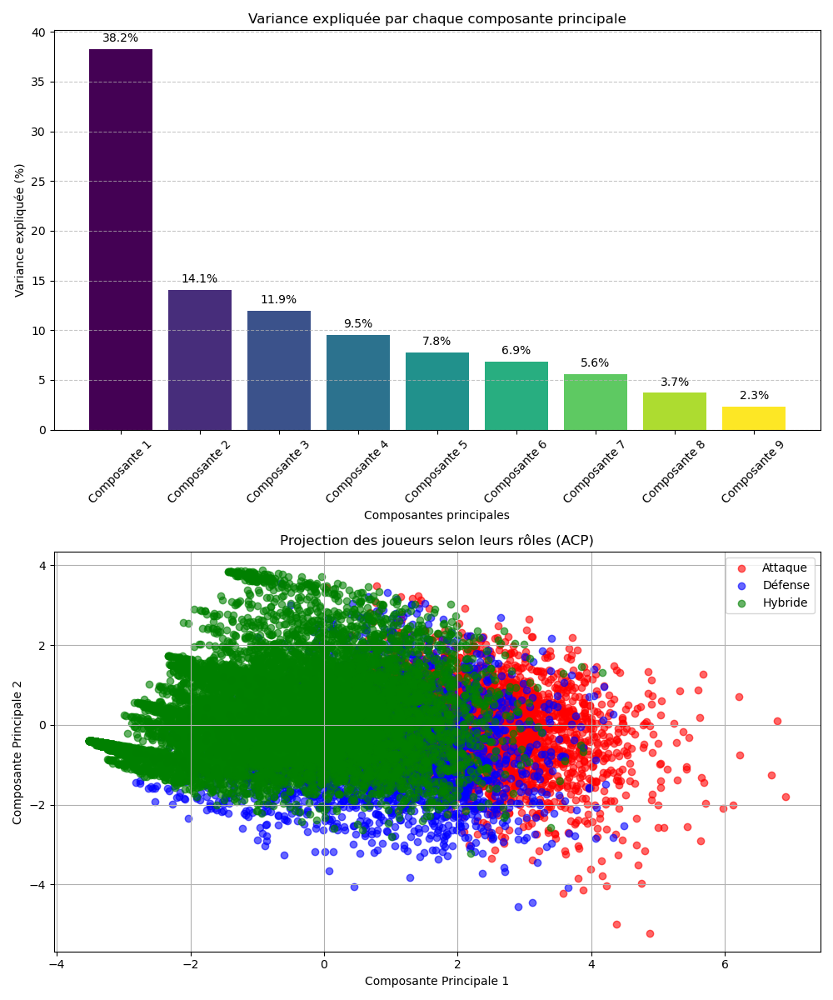
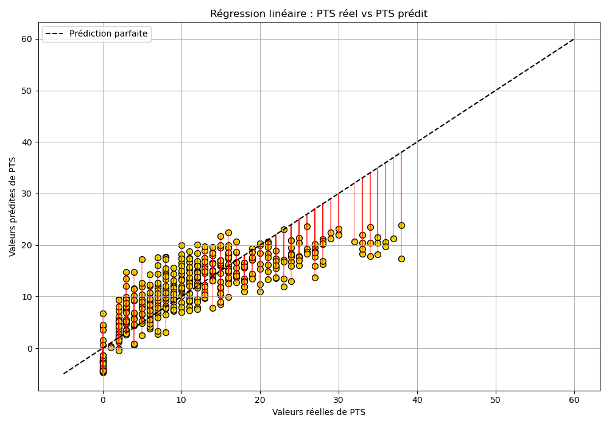
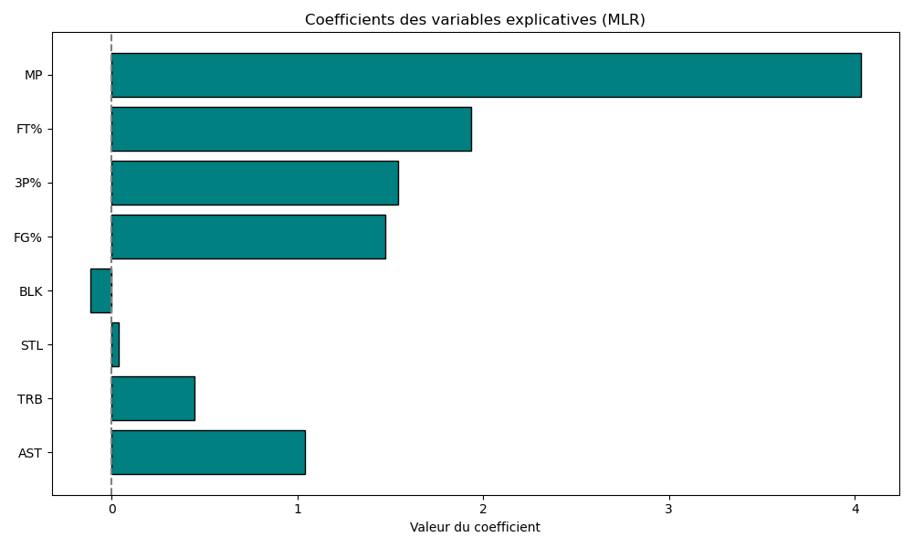
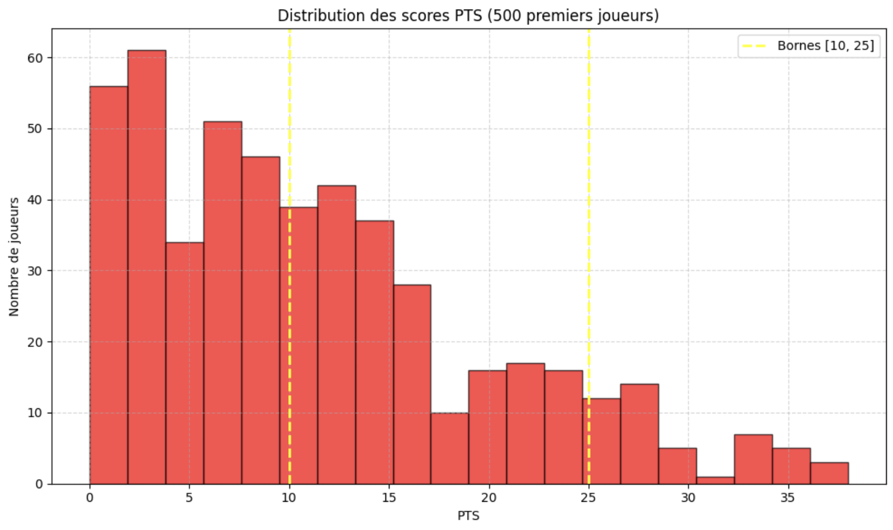
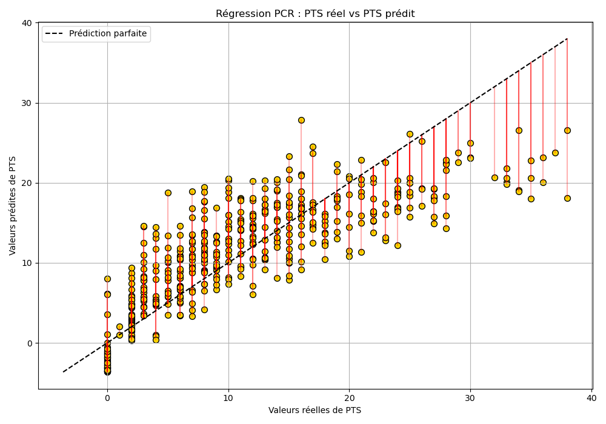

## Objectif du projet

L’objectif principal de ce projet est de mettre en œuvre une **analyse en composantes principales (ACP)** sur un jeu de données réel, afin d’évaluer son efficacité pour la réduction de dimension tout en conservant l’essentiel de l’information.

À des fins comparatives, deux modèles de régression sont ensuite construits :

- une **régression linéaire multiple (MLR)**, appliquée directement aux variables d’origine ;
- une **régression sur composantes principales (PCR)**, fondée sur les composantes extraites par l’ACP.

La variable cible de l’analyse est le **nombre de points marqués par match (PTS)**. Toutefois, ce choix est principalement motivé par sa pertinence pratique, et sert ici de **prétexte méthodologique** pour comparer les approches.

L’étude met en évidence les **avantages méthodologiques de l’ACP**, notamment sa capacité à :

- simplifier les modèles prédictifs,
- atténuer les effets de la multicolinéarité,
- et révéler des structures sous-jacentes utiles à l’interprétation.

## Données utilisées

L’ensemble de données analysé dans ce projet provient de la plateforme [NBA - Player Stats - Season 24/25](https://www.kaggle.com/datasets/eduardopalmieri/nba-player-stats-season-2425), publié sur Kaggle sous licence MIT.  
Il contient plus de **16 000 observations** de joueurs issues de la saison NBA 2024/2025.

Pour optimiser la lisibilité des résultats et réduire le temps de calcul, seules les 500 premières lignes de l’ensemble de données ont été retenues. Cet échantillon a été considéré comme représentatif et diversifié.

---

## Méthodologie

1. **Prétraitement des données**  
   Sélection de **9 variables quantitatives** pertinentes :  
   *PTS, AST, TRB, STL, BLK, FG%, 3P%, FT%, MP*  
   Ces variables reflètent les dimensions offensives, défensives et hybrides du jeu.
   Les données ont été standardisées (z-score) pour les rendre comparables.

2. **Analyse en composantes principales (ACP)**  
   Une ACP a été réalisée sur les 9 variables sélectionnées, sans variable cible.  
   Les **7 premières composantes** ont permis d’expliquer environ **94 % de la variance totale**.

3. **Modélisation**  
   Deux modèles de régression ont été construits :
   - **Régression linéaire multiple (MLR)** sur les 8 variables explicatives originales, avec *PTS* comme variable cible.
   - **Régression sur composantes principales (PCR)**, utilisant les 7 composantes issues de l’ACP pour prédire *PTS*.

4. **Évaluation des modèles**  
   Les performances ont été comparées à l’aide de :
   - Coefficient de détermination **$R^2$**
   - Erreur quadratique moyenne (**MCO**)
   - Visualisations : prédictions vs valeurs réelles de *PTS*

## Résultats

| Modèle | $R^2$ | Erreur quadratique moyenne (MCO) |
|--------|------|-----------------------------------|
| MLR    | 0.678 | 25.08                            |
| PCR    | 0.650 | 27.06                            |

Les deux modèles présentent des performances comparables.  
Le modèle de régression linéaire multiple (MLR) montre une meilleure précision, tandis que la régression sur composantes principales (PCR) offre une meilleure stabilité en présence de multicolinéarité.  
Le choix entre ces deux approches dépend donc du compromis recherché entre précision brute et robustesse statistique.

## Compatibilité des environnements

Les scripts Python du dossier `src/` ont été testés dans les environnements suivants :

- Google Colab  
- Spyder (via Anaconda)  
- Jupyter Notebook

### Chemins relatifs aux données

Selon l’environnement utilisé, le chemin d’accès au fichier CSV peut varier :

- Dans les scripts `.py` (exécutés depuis `src/`) :  
  `../data/nba_player_stats.csv`

- Dans les notebooks `.ipynb` (exécutés depuis la racine du projet) :  
  `data/nba_player_stats.csv`

Veillez à adapter le chemin en fonction de votre environnement d’exécution.

## Reproductibilité

Les principales figures présentées dans ce projet peuvent être reproduites à l’aide des fichiers Python suivants (situés dans le dossier `src/`) :

- `01_pca_analysis_plots.py` : génération des graphiques liés à l’analyse en composantes principales (ACP)  
- `02_mlr_analysis.py` : exécution de la régression linéaire multiple (MLR)  
- `03_pts_distribution_plot.py` : visualisation de la distribution des scores PTS  
- `04_pcr_residuals_plot.py` : représentation des résidus issus de la régression sur composantes principales (PCR)

Chaque script peut être exécuté de manière indépendante afin de reproduire les résultats présentés dans le mémoire.  
Avant l’exécution, assurez-vous que le chemin d’accès au fichier `nba_player_stats.csv` est correctement défini selon votre environnement.

### Exemples de sorties graphiques

#### 1. Analyse en composantes principales (ACP)

Les données ont été standardisées avant l’ACP afin d’éviter qu’une variable à grande échelle (comme MP) domine l’analyse.
L’ACP a été réalisée sur 9 variables quantitatives.
Le graphique du haut montre la variance expliquée par les 9 composantes principales.
Le graphique du bas projette les joueurs selon les deux premières composantes, révélant une séparation partielle selon leurs rôles (attaque, défense, hybride).
#### 2. Régression linéaire multiple (MLR)

Un modèle de régression linéaire multiple a été construit en utilisant **8 variables explicatives standardisées**, avec **PTS** comme variable cible.  
Le graphique ci-dessous illustre les **erreurs de prédiction** : chaque point jaune représente une valeur prédite, et les segments rouges indiquent l’écart entre cette prédiction et la valeur réelle.  
Le modèle atteint un **coefficient de détermination** $R^2 = 0{,}678$ et une **erreur quadratique moyenne** (**MCO**) de **25,08**, ce qui indique une **précision satisfaisante dans l’ensemble**.

#### 2b. Coefficients estimés

Le tableau suivant présente les **coefficients estimés** du modèle de régression linéaire multiple.  
Le **terme constant** est estimé à **10,5209**, ce qui correspond à la valeur moyenne de PTS lorsque toutes les variables explicatives standardisées sont nulles.  
Les coefficients associés aux variables indiquent leur **influence marginale** sur le score PTS :

- Un **coefficient positif** (ex. : MP = 4.0315) signifie qu’une augmentation de cette variable est liée à une augmentation attendue de PTS.
- Un **coefficient négatif** (ex. : BLK = -0.1143) indique un effet inverse : plus le joueur fait de contres, **moins il marque** selon ce modèle. Cela peut s’expliquer par une **orientation plus défensive** de son profil.

Cette interprétation permet de mieux comprendre le **poids relatif** de chaque variable dans la prédiction.

#### 3. Distribution des scores PTS

La Figure montre que 42,6\,\% des joueurs de l’échantillon (213 sur 500) obtiennent un score compris entre 10 et 25 points par match. Cet intervalle constitue une zone d’intérêt clé pour évaluer la performance des modèles prédictifs, car il reflète à la fois la diversité des profils et la réalité statistique.

Cependant, il faut souligner que la distribution réelle des scores \(PTS\) ne suit pas exactement une loi normale. Cette divergence s’explique par la nature asymétrique des performances, influencée par plusieurs facteurs tels que le rôle des joueurs, les conditions de jeu, et les stratégies d’équipe. Par conséquent, l’utilisation d’un histogramme avec les bornes [10, 25] permet une représentation plus fidèle des données et une meilleure évaluation du modèle.

#### 4. Résidus du modèle PCR

  Le modèle PCR, construit à partir des 7 premières composantes principales expliquant environ 94 % de la variance totale, parvient à offrir des performances de prédiction proches de celles du modèle MLR, tout en utilisant une représentation plus compacte des données.

## Licence

Ce projet est publié sous licence **MIT**.  
Les données utilisées sont également fournies sous licence MIT, comme indiqué sur la page Kaggle du dataset concerné.

## 📚 Bibliothèques utilisées

Ce projet repose sur les bibliothèques Python suivantes :

- `pandas` : manipulation et traitement des données tabulaires  
- `numpy` : opérations mathématiques et vectorielles  
- `matplotlib` : visualisation graphique des résultats  
- `scikit-learn (sklearn)` :
  - `StandardScaler` : standardisation des variables
  - `PCA` : analyse en composantes principales
  - `LinearRegression` : modèle de régression linéaire
  - `r2_score`, `mean_squared_error` : métriques d’évaluation

- `os` : gestion des chemins et du système de fichiers  
- `google.colab` : utilisé uniquement pour l’exportation de fichiers si le projet est exécuté dans Google Colab

---

> Pour toute question concernant ce dépôt ou ce projet, vous pouvez contacter l’auteur via GitHub.

